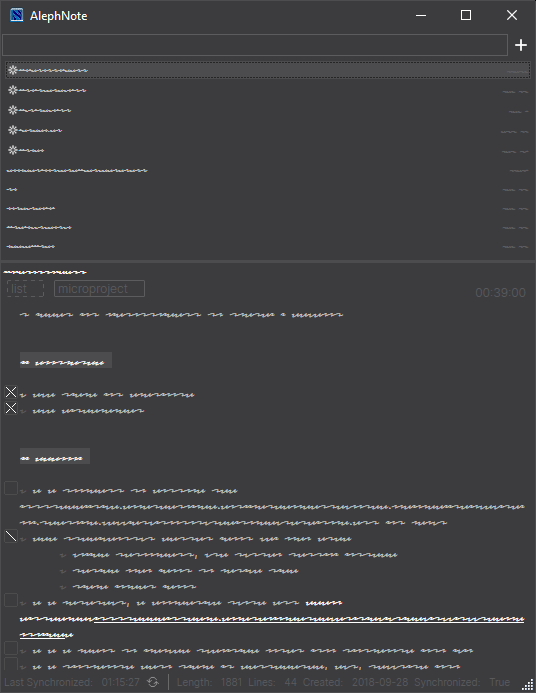
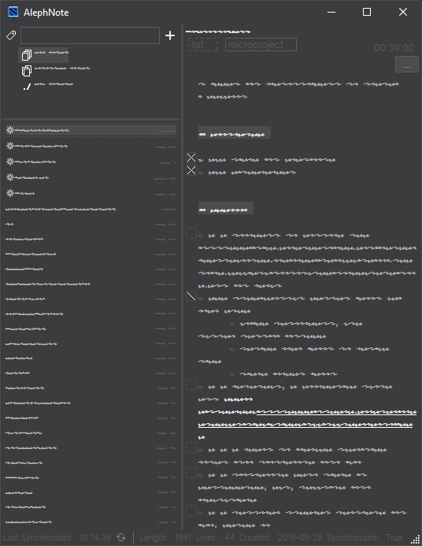

# /stachybotrys

A dark theme and iconset for [AlephNote](https://mikescher.github.io/AlephNote/), an extensible, lightweight desktop note client for multiple backends. Part of the bundled AlephNote themes. For usage notes and additional theme options, see the [AlephNote manual](https://github.com/Mikescher/AlephNote/wiki/Themeing).

## Approach

Built for the wonderfully customizable AlephNote, this theme and the following suggested configuration, is focused towards a keyboard-first approach, continuying the tradition of the opinionated [Notational Velocity](http://notational.net/) application.

## Screenshot configuration

To achieve the color blending between the titlebar and the app as in the following screenshots, set the Windows 10 accent color to the darkest gray possible (#3C3C3F), via `Personalisation → Colors → Custom color`.

### View → General

- [x] Hide tag search button
- [x] Use vertical layout
- [x] Auto hide menubar (Press <kbd>Alt</kbd> to toggle visibility)

### Theme → Modifiers

- [x] Hide scrollbars (incorporated in the theme, vertical scrollbar visible when available)
- [x] Stachybotrys icons

### Text Editor

- Highlighting →
    + Hyperlinkes: Clickable (single click)
    + Markdown: Always
    + Todo lists: Always

## Suggested Fonts

- Advanced → UI Font: Inter BETA*
- Text Editor →
    + Note: Anonymous Pro, 9pt
    + List: Inter BETA, 10pt
    + Title: Inter BETA, 11pt

<small>* Windows 10 hinting is improved over plain Inter</small>

## Screenshots

## Etymology

[Wikipedia: Stachybotrys](https://en.wikipedia.org/wiki/Stachybotrys): “The name comes from the Greek words *στάχυς* [stakhus] (ear of grain, stalk, stick; metaphorically, progeny) and *βότρυς* [botrus] (cluster or bunch as in grapes, trusses). Stachybotrys, also known as black mold or toxic black mold, is a variety of microfungus.”

---

© 2019-2020 [Heracles Papatheodorou](http://heracl.es) a.k.a [@Arty2](https://www.twitter.com/Arty2), [MIT Licence](LICENCE.txt)