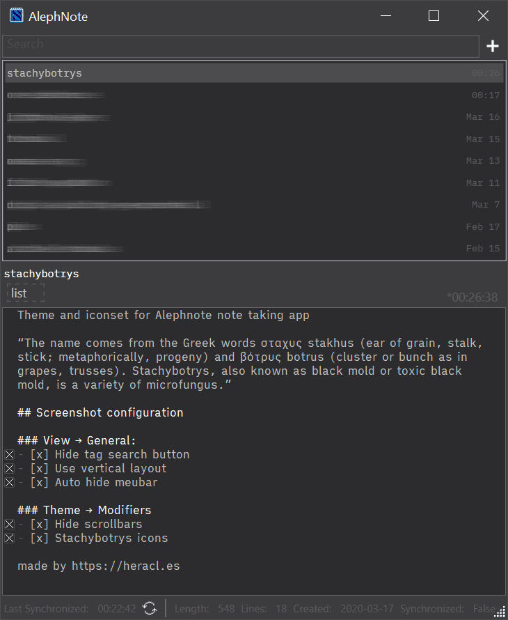

# /stachybotrys
A dark theme and iconset for [Alephnote](https://mikescher.github.io/AlephNote/) note taking app. For usage notes, see the [Alephnote manual](https://github.com/Mikescher/AlephNote/wiki/Themeing).

© 2019 [Heracles Papatheodorou](http://heracl.es) a.k.a [@Arty2](https://www.twitter.com/Arty2), [MIT Licence](LICENCE.txt)